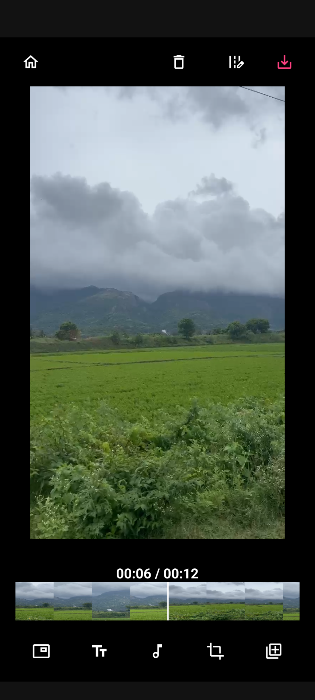
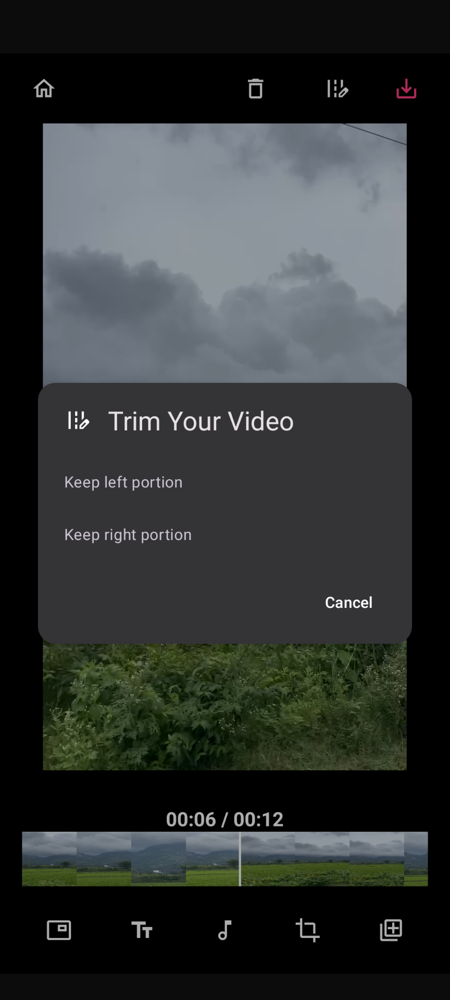

# LibreCuts


LibreCuts is a free, open-source video editor for Android that prioritizes simplicity and efficiency. With LibreCuts, you can easily select and edit videos while managing permissions seamlessly.

## Features

- **Trim**: Remove unwanted parts from the beginning or end of a video clip.
- **Overlay**: Place text or image on top of video clip.
- **Audio**: Manage soundtracks, including adding music or voiceovers.
- **Scale**: Adjust the size of a video or image within the frame.
- **Merge**: Combine multiple video clips into one continuous video.
- **Rotate**: Change the orientation of a video clip to correct its angle.

## Getting Started

### Prerequisites

- Android Studio
- Android SDK

### Installation

1. **Clone the repository**:
   ```bash
   git clone https://github.com/tharunbirla/LibreCuts.git
   ```
   
2. **Open the project in Android Studio**:
   - Launch Android Studio and select "Open an existing Android Studio project."
   - Navigate to the cloned directory and select it.

3. **Build the project**:
   - Click on "Build" in the menu, then select "Make Project."

4. **Run the app**:
   - Connect an Android device or start an emulator.
   - Click on the "Run" button in Android Studio.

## Permissions

LibreCuts requires the following permissions to function properly:

- **READ_EXTERNAL_STORAGE**: To read videos from the device.
- **WRITE_EXTERNAL_STORAGE**: (for older Android versions) To save edited videos.
- **POST_NOTIFICATIONS**: To show notifications related to video editing.
- **READ_MEDIA_AUDIO/VIDEO/IMAGES**: For accessing media files on devices running Android 13 (API level 33) and above.

## Code Structure

- **MainActivity.kt**: The main entry point of the app where video selection and permission management are handled.
- **VideoEditingActivity.kt**: The activity where the video editing functionalities will be implemented.

## Screenshots




## Contributing

Contributions are welcome! If you have suggestions or improvements, feel free to create a pull request or open an [issue](issues).

1. Fork the repository.
2. Create a new branch for your feature or bug fix.
3. Commit your changes.
4. Push to the branch.
5. Submit a pull request.

## License

This project is licensed under the MIT License. See the [LICENSE](LICENSE) file for details.

## Acknowledgements

- Special thanks to the contributors and libraries that made this project possible.
- Inspired by the need for a simple, open-source video editor for Android.